# MVP — Pipeline de Dados na Nuvem: Risco de Crédito

> Trabalho da pós-graduação em Machine Learning e Analytics (PUC-Rio).

> Sprint: Engenharia de Dados 

> Aluna: Cristina Silva Dias.

> Plataforma: Databricks Free Edition. Arquitetura: Medalhão (Bronze / Silver / Gold).

---

## 1. Contexto de Negócio e Perguntas (Etapas 2 e 4.1)

### Contexto

Este trabalho analisa fatores associados ao risco de inadimplência de clientes de crédito,
utilizando dados cadastrais e de histórico de crédito externo (bureau).

### Dataset e licença
- **Fonte:** Home Credit Default Risk (Kaggle Competition)
- **Link:** https://www.kaggle.com/competitions/home-credit-default-risk
- **Regras da competição:** https://www.kaggle.com/competitions/home-credit-default-risk/rules
- **Licença/uso dos dados:** dados da competição, disponibilizados pela Home Credit International
  a.s. via Kaggle. Conforme a seção 7 ("Competition Data") das regras da competição, o acesso é
  condicionado ao aceite das regras (login + "I Understand and Accept"), e não é permitida a
  redistribuição dos arquivos brutos a terceiros. Uso neste trabalho é exclusivamente educacional,
  sem redistribuição dos CSVs.
- **Tabelas brutas utilizadas:**
  - `application_train.csv` — dados cadastrais e de crédito por cliente (1 linha = 1 cliente, ~307 mil registros, 122 colunas)
  - `bureau.csv` — histórico de crédito do cliente em outras instituições financeiras (múltiplas linhas por cliente)

### Perguntas de negócio
1. Qual a taxa de inadimplência por faixa de renda, tipo de contrato e escolaridade?
2. Clientes com mais consultas/registros de crédito recentes no bureau têm maior taxa de default?
3. A idade ou o tempo de relacionamento com o empregador influenciam o risco de inadimplência?
4. Clientes com dívidas ativas em outras instituições (bureau) têm perfil de risco diferente dos
   clientes sem histórico de crédito externo?

---

## 2. Carga dos Dados (Etapa 4.2)

- Script: [`notebooks/01_bronze_ingestion.py`](notebooks/01_bronze_ingestion.py)
- Local de armazenamento na nuvem: um Volume do Unity Catalog, criado no schema `dados_credito`
  do catálogo `mvp_credito`, com caminho `/Volumes/mvp_credito/dados_credito/dados`
- Método: upload manual dos arquivos `application_train.csv` (158,44 MB) e `bureau.csv`
  (162,14 MB), baixados do Kaggle, direto pela interface do Catalog Explorer do Databricks
- Metadados de controle adicionados na leitura: `_ingestion_date`, `_source_file`

Evidência do upload dos arquivos brutos no Volume:

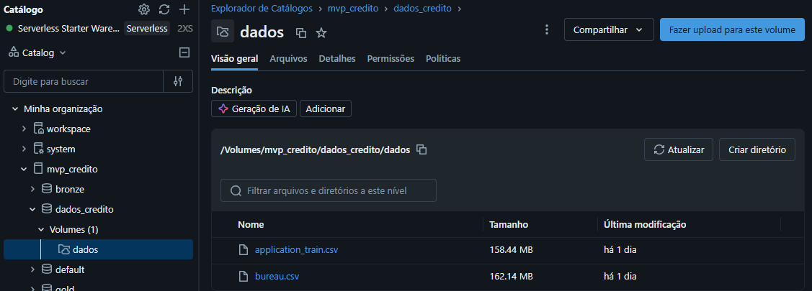

Evidência da execução — 307.511 linhas em `bronze.application_train_raw` e 1.716.428 linhas em
`bronze.bureau_raw`, confirmando a carga completa dos dois arquivos:

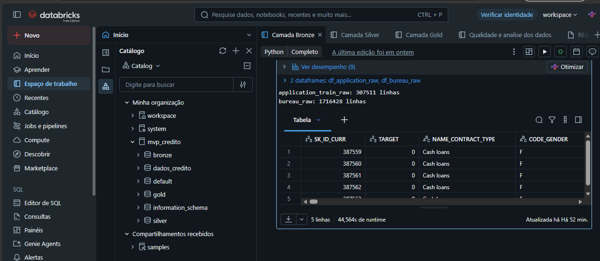

---

## 3. Modelagem e Catálogo de Dados (Etapa 4.3)

### Modelagem
Optou-se por um **modelo flat** (uma tabela ampla por conceito) em vez de um esquema estrela
clássico com tabelas fato/dimensão separadas. Justificativa: o objetivo do MVP é responder
perguntas analíticas agregadas por perfil de cliente, não construir um Data Warehouse
transacional com múltiplas dimensões reutilizáveis. Com apenas duas fontes (cadastro de cliente
e histórico de bureau), um esquema estrela adicionaria complexidade de junção sem ganho real de
performance ou clareza neste escopo. A tabela `gold.fato_risco_cliente` concentra, por cliente,
tanto os atributos cadastrais quanto as métricas agregadas do bureau funcionando como uma
"tabela larga" pronta para consumo, e as demais tabelas Gold são agregações derivadas dela, uma
por pergunta de negócio.

| Camada | Schema.Tabela | Descrição |
|---|---|---|
| Bronze | `bronze.application_train_raw` | Dados cadastrais brutos, como recebidos |
| Bronze | `bronze.bureau_raw` | Histórico de crédito externo bruto |
| Silver | `silver.clientes` | Dados cadastrais limpos e tipados, com anomalia de DAYS_EMPLOYED tratada |
| Silver | `silver.historico_credito` | Histórico de crédito limpo, deduplicado |
| Gold | `gold.fato_risco_cliente` | 1 linha por cliente: atributos + métricas agregadas de bureau + flags derivadas |
| Gold | `gold.agg_risco_por_segmento` | Taxa de default por faixa de renda, contrato e escolaridade (Pergunta 1) |
| Gold | `gold.agg_risco_por_bureau` | Taxa de default por faixa de qtd. de créditos no bureau (Pergunta 2) |
| Gold | `gold.agg_risco_por_idade` | Taxa de default por faixa etária e tempo de emprego (Pergunta 3) |
| Gold | `gold.agg_risco_por_divida_externa` | Taxa de default por perfil de dívida externa (Pergunta 4) |

### Catálogo de Dados
Descrição, domínio e linhagem de cada campo (também gravados como `COMMENT`/`ALTER COLUMN` no
Unity Catalog pelos notebooks 02 e 03 ver screenshots abaixo).

**Tabela: `silver.clientes`** — origem: `bronze.application_train_raw`

| Campo | Domínio de valores | Descrição | Linhagem |
|---|---|---|---|
| `sk_id_curr` | inteiro > 0, chave primária | Identificador único do cliente | `SK_ID_CURR`, sem transformação |
| `target` | 0 ou 1 | 1 = teve dificuldade de pagamento (inadimplente) | `TARGET`, sem transformação |
| `tipo_contrato` | 'Cash loans', 'Revolving loans' | Tipo de contrato de crédito solicitado | `NAME_CONTRACT_TYPE` |
| `genero` | 'M', 'F', 'XNA' | Gênero do cliente | `CODE_GENDER` |
| `possui_carro` | 'Y', 'N' | Se o cliente possui carro | `FLAG_OWN_CAR` |
| `possui_imovel` | 'Y', 'N' | Se o cliente possui imóvel | `FLAG_OWN_REALTY` |
| `qtd_filhos` | inteiro ≥ 0 | Número de filhos | `CNT_CHILDREN` |
| `renda_total` | decimal > 0 (com outliers extremos) | Renda total anual declarada | `AMT_INCOME_TOTAL` |
| `valor_credito_solicitado` | decimal > 0 | Valor do crédito solicitado | `AMT_CREDIT` |
| `valor_parcela` | decimal > 0, pode ser nulo | Valor da parcela (anuidade) | `AMT_ANNUITY` |
| `tipo_renda` | ex. 'Working', 'Pensioner' | Categoria da fonte de renda | `NAME_INCOME_TYPE` |
| `escolaridade` | ex. 'Higher education' | Nível de escolaridade | `NAME_EDUCATION_TYPE` |
| `estado_civil` | ex. 'Married', 'Single' | Estado civil | `NAME_FAMILY_STATUS` |
| `tipo_moradia` | ex. 'House / apartment' | Tipo de moradia | `NAME_HOUSING_TYPE` |
| `ocupacao` | categórico, pode ser nulo | Ocupação profissional | `OCCUPATION_TYPE` |
| `qtd_membros_familia` | inteiro ≥ 1 | Nº de membros da família | `CNT_FAM_MEMBERS` |
| `rating_regiao` | inteiro 1 (melhor) a 3 (pior) | Rating da região de moradia | `REGION_RATING_CLIENT` |
| `score_externo_1/2/3` | decimal 0–1, pode ser nulo | Scores de crédito de fontes externas | `EXT_SOURCE_1/2/3` |
| `idade` | inteiro, ~18–70 | Idade do cliente em anos | derivado de `DAYS_BIRTH` (abs/365.25) |
| `anos_empregado` | inteiro ≥ 0, nulo se sem vínculo | Anos de vínculo empregatício | derivado de `DAYS_EMPLOYED`, anomalia 365243 tratada como nulo |
| `sem_vinculo_empregaticio` | true/false | Flag de cliente sem vínculo formal | derivado do tratamento da anomalia `DAYS_EMPLOYED` |

**Tabela: `silver.historico_credito`** — origem: `bronze.bureau_raw`

| Campo | Domínio de valores | Descrição | Linhagem |
|---|---|---|---|
| `sk_id_curr` | inteiro > 0, FK | Identificador do cliente | `SK_ID_CURR` |
| `sk_id_bureau` | inteiro > 0, chave primária | Identificador único do crédito no bureau | `SK_ID_BUREAU` |
| `status_credito` | 'Active', 'Closed', 'Sold', 'Bad debt' | Situação do crédito | `CREDIT_ACTIVE` |
| `tipo_credito` | ex. 'Consumer credit', 'Credit card' | Tipo de crédito reportado | `CREDIT_TYPE` |
| `dias_desde_abertura` | negativo (dias no passado) | Dias desde a abertura do crédito | `DAYS_CREDIT` |
| `dias_ate_vencimento` | pode ser nulo | Dias até o vencimento previsto | `DAYS_CREDIT_ENDDATE` |
| `valor_credito` | decimal ≥ 0 | Valor total do crédito concedido | `AMT_CREDIT_SUM` |
| `valor_divida_atual` | decimal ≥ 0 | Saldo devedor atual | `AMT_CREDIT_SUM_DEBT`, nulo tratado como 0 |
| `valor_em_atraso` | decimal ≥ 0 | Valor em atraso no reporte | `AMT_CREDIT_SUM_OVERDUE`, nulo tratado como 0 |
| `dias_atraso` | inteiro ≥ 0 | Dias de atraso no reporte | `CREDIT_DAY_OVERDUE` |

**Tabela: `gold.fato_risco_cliente`** — origem: `silver.clientes` + agregação de `silver.historico_credito`

Contém todos os campos de `silver.clientes`, mais:

| Campo | Domínio de valores | Descrição | Linhagem |
|---|---|---|---|
| `qtd_creditos_bureau` | inteiro ≥ 0 | Nº total de créditos do cliente no bureau | `COUNT` de `historico_credito` por `sk_id_curr` |
| `qtd_creditos_ativos_bureau` | inteiro ≥ 0 | Nº de créditos com status 'Active' | agregado condicional |
| `valor_total_credito_bureau` | decimal ≥ 0 | Soma do valor de todos os créditos no bureau | `SUM(valor_credito)` |
| `divida_total_bureau` | decimal ≥ 0 | Soma do saldo devedor atual no bureau | `SUM(valor_divida_atual)` |
| `valor_total_atraso_bureau` | decimal ≥ 0 | Soma dos valores em atraso no bureau | `SUM(valor_em_atraso)` |
| `possui_historico_bureau` | true/false | Se o cliente tem ao menos 1 registro no bureau | derivado de `qtd_creditos_bureau > 0` |
| `faixa_renda` | 'baixa (<100k)', 'média (100k-300k)', 'alta (>300k)' | Faixa de renda para agregação | derivado de `renda_total` |
| `faixa_etaria` | '18-29', '30-39', '40-49', '50-59', '60+' | Faixa etária para agregação | derivado de `idade` |

**Tabelas `gold.agg_risco_por_*`** (segmento, bureau, idade, dívida externa): tabelas de
agregação (contagem de clientes + taxa média de `target`), uma por pergunta de negócio — campos
autoexplicativos pelos nomes, detalhados nos comentários de tabela dos notebooks.

**Evidência — comentários gravados no Unity Catalog:**

`silver.clientes`:

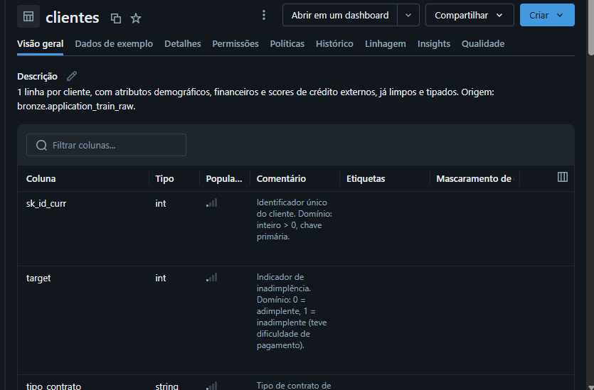

`silver.historico_credito`:

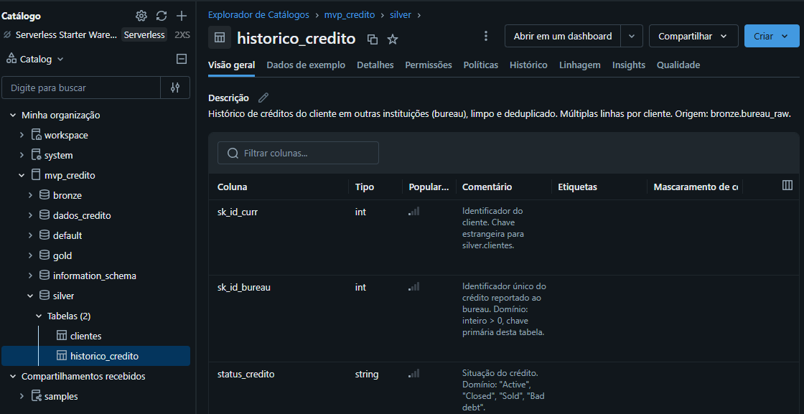

`gold.fato_risco_cliente`:

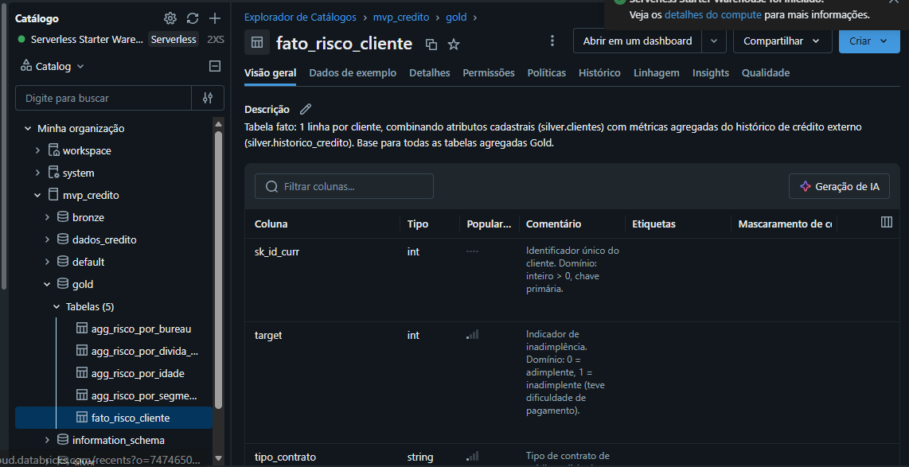

`gold.agg_risco_por_segmento` (Pergunta 1):

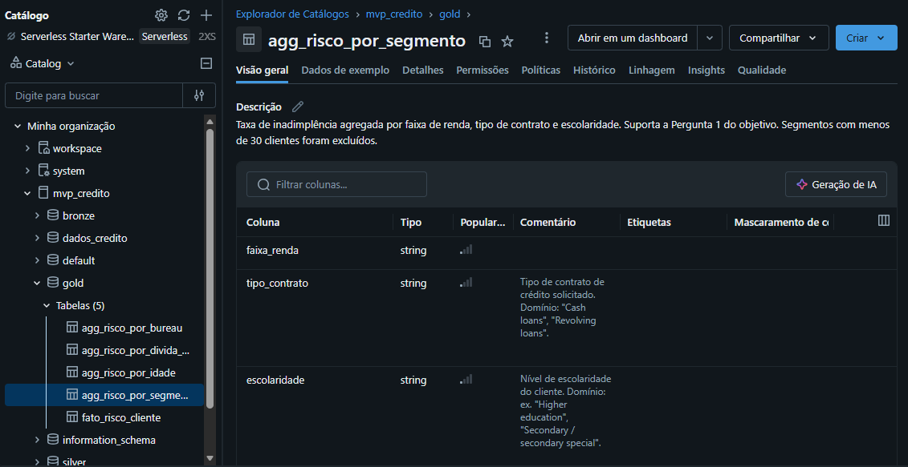

`gold.agg_risco_por_bureau` (Pergunta 2):

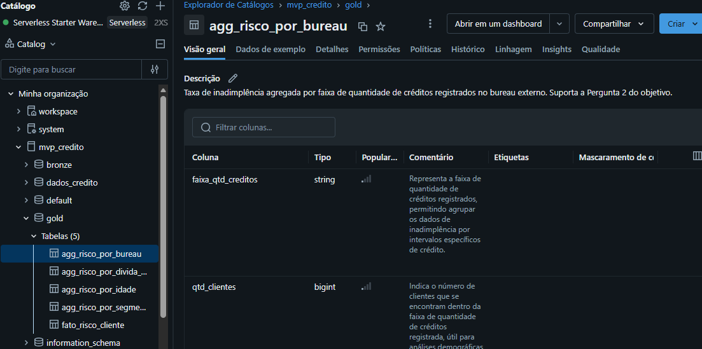

`gold.agg_risco_por_idade` (Pergunta 3):

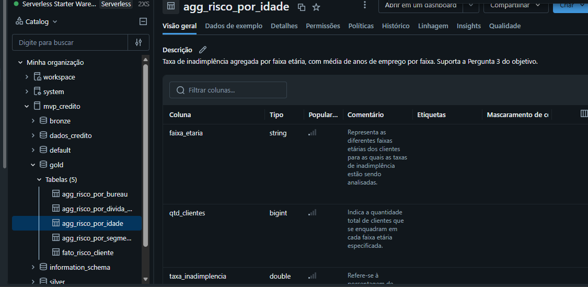

`gold.agg_risco_por_divida_externa` (Pergunta 4):

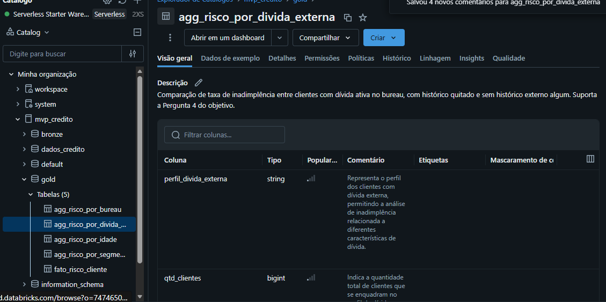

---

## 4. Pipeline de Dados (Etapa 4.4)

O pipeline foi organizado em 4 notebooks, um por etapa da arquitetura medalhão, executados nesta
ordem sequencial:

| Ordem | Notebook | O que faz |
|---|---|---|
| 1 | [`01_bronze_ingestion.py`](notebooks/01_bronze_ingestion.py) | Ingestão dos CSVs brutos a partir do Volume |
| 2 | [`02_silver_transform.py`](notebooks/02_silver_transform.py) | Limpeza, tipagem, tratamento da anomalia DAYS_EMPLOYED, comentários de catálogo |
| 3 | [`03_gold_modeling.py`](notebooks/03_gold_modeling.py) | Tabela fato + 4 tabelas agregadas (1 por pergunta), comentários de catálogo |
| 4 | [`04_qualidade_e_analise.py`](notebooks/04_qualidade_e_analise.py) | Checks de qualidade e análise gráfica (matplotlib) por pergunta |

**Principais transformações do pipeline:**
- Bronze → Silver: tipagem e limpeza de `application_train_raw` e `bureau_raw`, com tratamento
  específico da anomalia `DAYS_EMPLOYED = 365243` (ver seção 5).
- Silver → Gold: agregação de `silver.historico_credito` por `sk_id_curr` (contagem de créditos,
  soma de valores e atrasos) seguida de LEFT JOIN com `silver.clientes`, formando
  `gold.fato_risco_cliente`. As 4 tabelas `gold.agg_risco_por_*` são agregações derivadas dessa
  tabela fato, uma por pergunta de negócio.

Evidência da execução da camada Silver — 307.511 linhas em `silver.clientes` e 1.716.428 linhas
em `silver.historico_credito`, confirmando que a limpeza preservou o volume total de registros
(nenhuma linha perdida por erro, apenas as transformações documentadas):

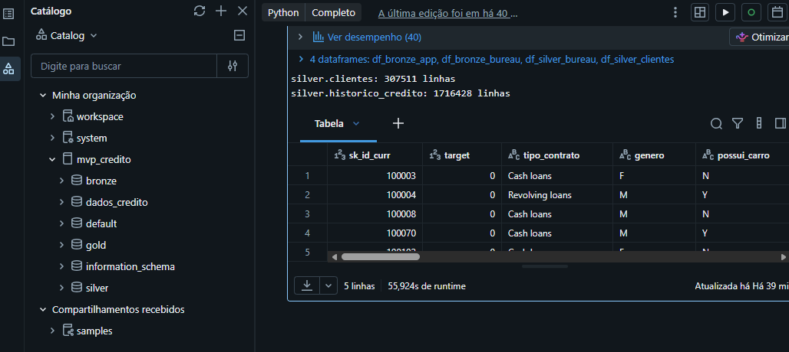

A árvore do Catalog Explorer (visível nos screenshots acima) confirma a estrutura final:
catálogo `mvp_credito` com os schemas `bronze`, `silver` e `gold`, cada um com suas respectivas
tabelas persistidas em Delta.

---

## 5. Qualidade de Dados (Etapa 4.5)

Verificação executada sobre `silver.clientes` (307.511 registros) e `silver.historico_credito`,
no notebook `04_qualidade_e_analise.py`.

### Completude

| Atributo | Nulos | % Nulos | Observação |
|---|---|---|---|
| `renda_total` | 0 | 0,00% | Completo |
| `idade` | 0 | 0,00% | Completo |
| `tipo_contrato` | 0 | 0,00% | Completo |
| `escolaridade` | 0 | 0,00% | Completo |
| `anos_empregado` | 55.374 | 18,01% | Nulo por construção — corresponde exatamente aos clientes sem vínculo empregatício formal (ver Consistência abaixo); não é dado faltante por erro |
| `ocupacao` | 96.391 | 31,35% | Cliente não informou ocupação; mantido como categoria "não informado" implícita, não tratado por não ser central às 4 perguntas |
| `score_externo_1` | 173.378 | 56,38% | Mais da metade dos clientes sem cobertura desta fonte externa — esperado, já que nem toda fonte externa cobre todos os clientes; não utilizado nas agregações Gold por esse motivo |
| `score_externo_2` | 660 | 0,21% | Praticamente completo |
| `score_externo_3` | 60.965 | 19,83% | Cobertura parcial, mesma natureza de `score_externo_1` |

### Consistência

A anomalia conhecida deste dataset em `DAYS_EMPLOYED` (valor `365243`, usado como *placeholder*
para "sem vínculo empregatício") foi identificada e tratada na Silver. **55.374 clientes (18,01%
da base)** se enquadram nessa condição — o mesmo número exato dos nulos em `anos_empregado`,
confirmando que o tratamento foi aplicado de forma consistente.

### Unicidade

- `silver.clientes`: **0 duplicatas** de `sk_id_curr`.
- `silver.historico_credito`: **0 duplicatas** de `sk_id_bureau`.

A deduplicação aplicada na Silver não removeu registros,  a base já chegava sem duplicatas nessas
chaves, o que foi confirmado pela verificação.

### Acurácia / Outliers

| Atributo | Min | P25 | Mediana | P75 | Max | Observação |
|---|---|---|---|---|---|---|
| `renda_total` | 25.650 | 112.500 | 146.700 | 202.500 | **117.000.000** | Outlier extremo confirmado: o valor máximo é ~800x a mediana. Não removido das tabelas Gold (não distorce agregações por faixa), mas seria candidato a tratamento (cap ou remoção) num modelo preditivo |
| `idade` | 20 | 33 | 43 | 53 | 69 | Sem anomalias — intervalo plausível para clientes de crédito |

Evidência da execução (resumo estatístico gerado diretamente no Databricks):

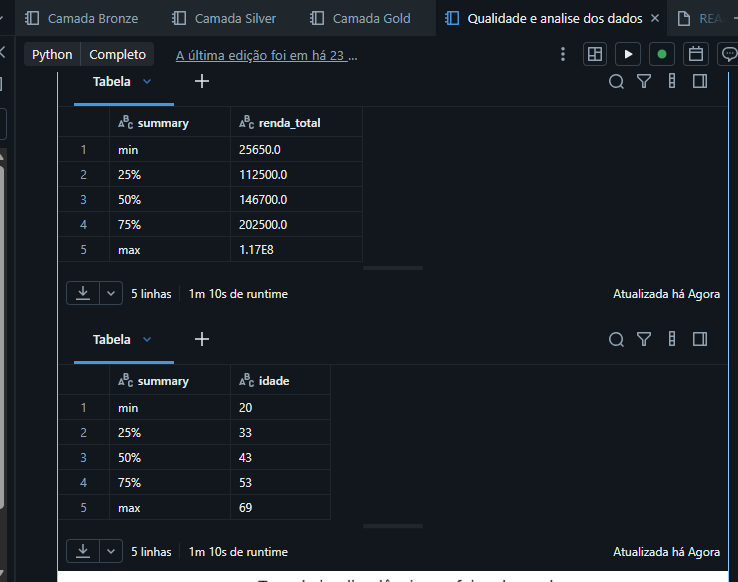

**Conclusão da verificação:** a base está com boa qualidade estrutural (sem duplicatas, poucos
nulos nos atributos centrais). O único ponto de atenção real é o outlier de renda, já mapeado, e a
cobertura parcial dos scores externos ambos documentados e considerados na etapa de análise.

---

## 6. Análise de Dados (Etapa 4.5)

Para cada pergunta definida na seção 1, apresenta-se a query/abordagem utilizada, o resultado
(com evidência de execução no Databricks) e a discussão do que o resultado significa no contexto
do problema.

### Pergunta 1: Taxa de inadimplência por faixa de renda, contrato e escolaridade

**Execução no Databricks:**

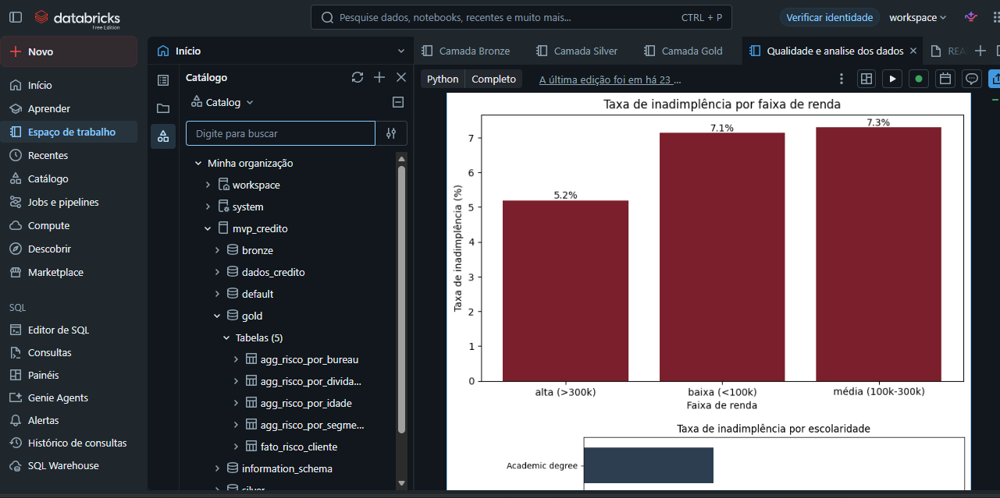
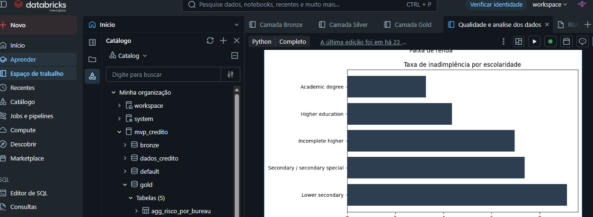

**Por faixa de renda:**

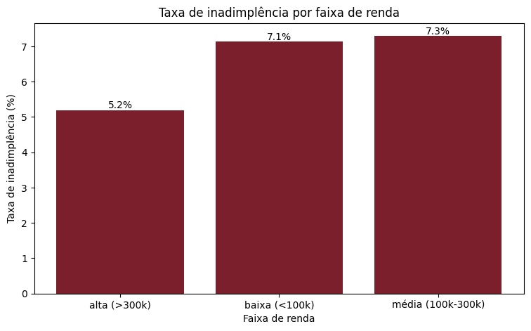

| Faixa de renda | Taxa de inadimplência |
|---|---|
| Alta (>300k) | 5,2% |
| Baixa (<100k) | 7,1% |
| Média (100k-300k) | 7,3% |

**Por escolaridade:**

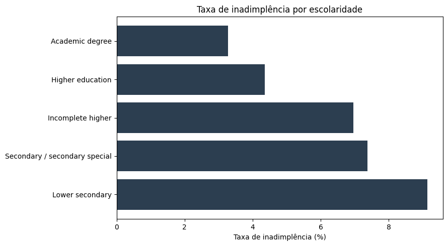

- Discussão: renda alta reduz claramente o risco (5,2% vs. ~7,2% nas demais faixas), mas a
  diferença entre renda baixa e média é pequena e contraintuitiva a faixa média tem risco
  ligeiramente **maior** que a baixa, não menor. Isso sugere que renda isolada não é um preditor
  linear forte; provavelmente interage com o valor do crédito solicitado (clientes de renda média
  podem estar tomando créditos proporcionalmente mais altos).
  Já a escolaridade mostra um **gradiente muito mais nítido e monotônico**: de 3,3%
  ("Academic degree") a 9,1% ("Lower secondary") quase 3x de diferença entre os extremos. Isso é
  coerente com a literatura de risco de crédito, em que escolaridade costuma ser um proxy melhor
  de estabilidade financeira do que a renda declarada isoladamente.

### Pergunta 2: Clientes com mais créditos no bureau têm maior taxa de default?

**Execução no Databricks:**

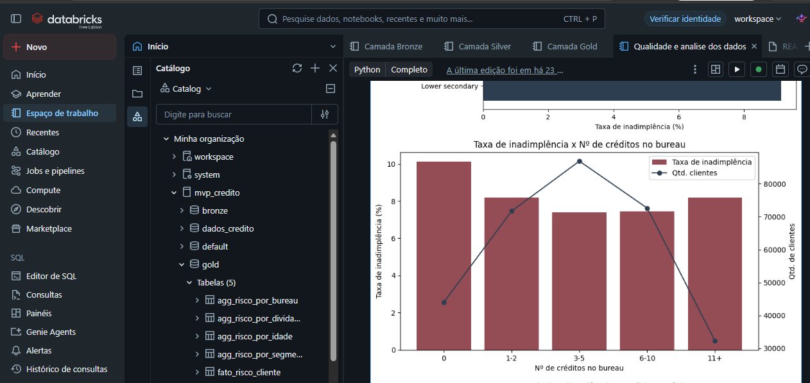

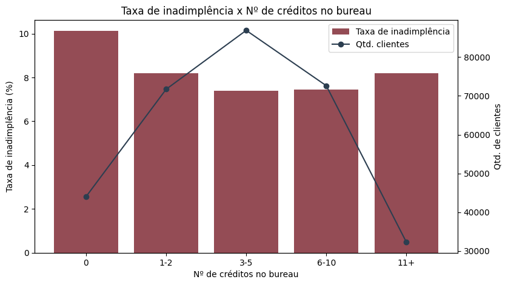

| Nº créditos no bureau | Qtd. clientes | Taxa de inadimplência |
|---|---|---|
| 0 | ~44 mil | 10,1% |
| 1-2 | ~72 mil | 8,2% |
| 3-5 | ~86 mil | 7,4% |
| 6-10 | ~72 mil | 7,5% |
| 11+ | ~32 mil | 8,2% |

- Discussão: a relação **não é linear é em formato de U**. Clientes sem nenhum histórico no
  bureau (0 créditos) têm o maior risco (10,1%), o que é um resultado relevante: a ausência de
  histórico de crédito não é neutra, é um sinal de risco por si só (provavelmente por falta de
  informação para avaliar o comportamento de pagamento). O risco cai e atinge o mínimo na faixa
  intermediária (3-5 créditos, 7,4%), e volta a subir levemente para quem tem muitos créditos
  (11+, 8,2%) — possivelmente clientes mais endividados/alavancados. Isso responde a pergunta de
  forma mais rica do que um "sim/não": nem pouco nem muito histórico é o ideal.

### Pergunta 3: A idade e o tempo de emprego influenciam o risco de inadimplência?

**Execução no Databricks:**

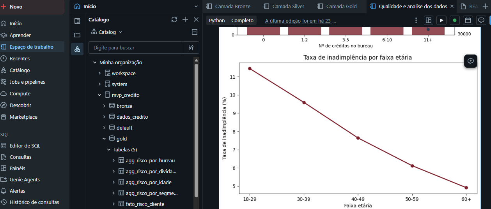
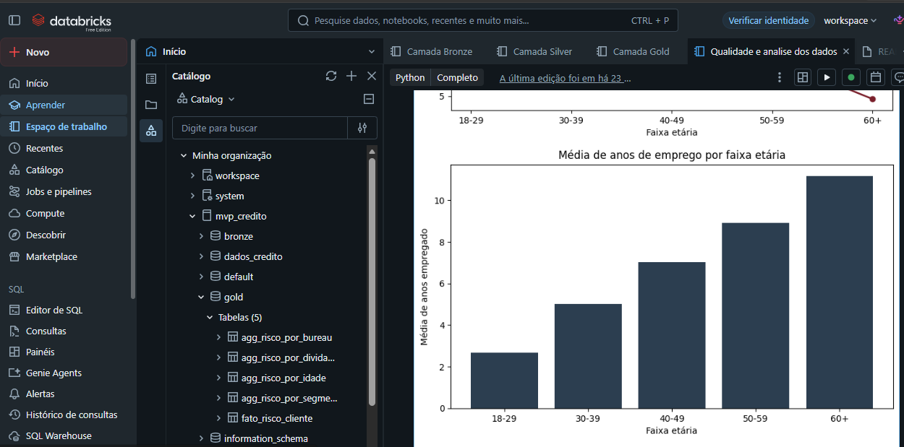

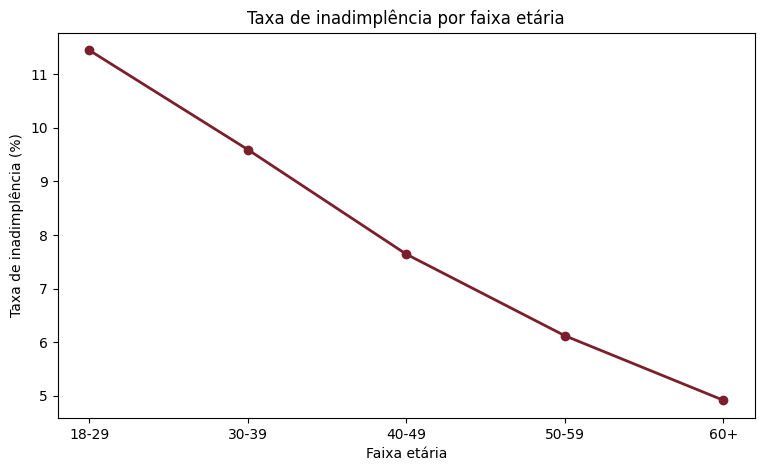
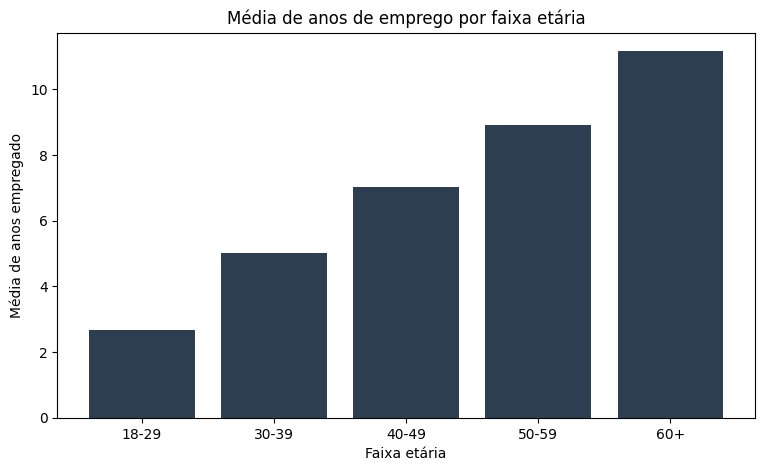

| Faixa etária | Taxa de inadimplência | Média anos empregado |
|---|---|---|
| 18-29 | 11,4% | 2,7 |
| 30-39 | 9,6% | 5,0 |
| 40-49 | 7,6% | 7,0 |
| 50-59 | 6,1% | 8,9 |
| 60+ | 4,9% | 11,2 |

- Discussão: relação **monotônica e forte** em ambas as variáveis: quanto mais jovem, maior o
  risco (18-29 tem quase o dobro do risco de 60+), e o tempo de emprego cresce de forma
  praticamente proporcional à idade. As duas variáveis estão correlacionadas e reforçam a mesma
  conclusão: estabilidade profissional (medida pelo tempo de emprego, que naturalmente acumula
  com a idade) é um forte indicador de menor risco. Isso é o padrão mais claro e consistente entre
  as 4 perguntas.

### Pergunta 4: Clientes com dívida ativa externa têm perfil de risco diferente?

**Execução no Databricks:**

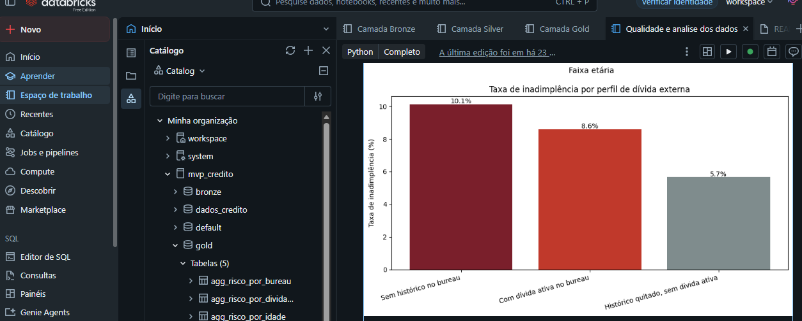
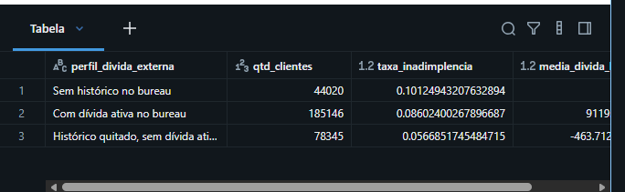

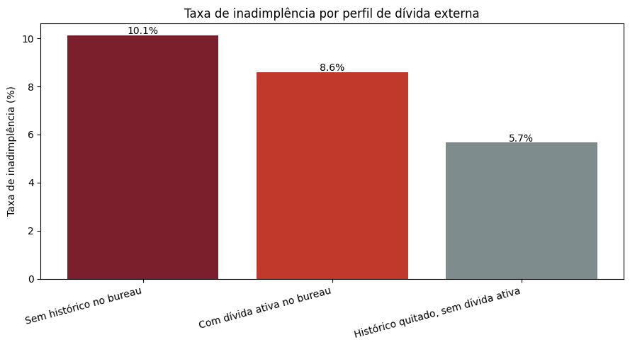

| Perfil | Qtd. clientes | Taxa de inadimplência | Média dívida bureau |
|---|---|---|---|
| Sem histórico no bureau | 44.020 | 10,1% | — |
| Com dívida ativa no bureau | 185.146 | 8,6% | R$ 911.939 |
| Histórico quitado, sem dívida ativa | 78.345 | 5,7% | — |

- Discussão: resultado **contraintuitivo**. O senso comum
  sugeriria que "sem dívida ativa" = menor risco e "sem histórico" = risco neutro/desconhecido.
  Os dados mostram o oposto: clientes **sem histórico algum no bureau são o grupo de maior risco**
  (10,1%), enquanto clientes com **histórico quitado** (que já provaram capacidade de pagar e
  encerrar um crédito) são o grupo de **menor risco** (5,7%) menos da metade do risco do primeiro
  grupo. Clientes com dívida ativa ficam numa posição intermediária. Isso reforça a conclusão da
  Pergunta 2: um histórico de crédito positivo é um ativo de informação, e sua ausência pesa mais
  contra o cliente do que se poderia supor. Para uma política de crédito real, isso sugere que
  histórico de bureau mesmo com dívida em aberto  é preferível a nenhum histórico.

### Discussão geral

As quatro análises convergem para uma conclusão coerente: **o histórico comportamental do cliente
(tempo de emprego, histórico de crédito, escolaridade) é um preditor de risco mais forte e mais
consistente do que atributos estáticos como renda declarada isolada**. O resultado mais importante
para uma política de crédito é o das Perguntas 2 e 4: ausência de histórico no bureau é, na
prática, um sinal de risco maior do que ter dívida ativa, algo que pode não ser óbvio em uma
política que trate "sem histórico" como neutro. A relação não-linear (em U) entre quantidade de
créditos e risco (Pergunta 2) também é um ponto de atenção: políticas que usem "quantidade de
créditos" como variável devem considerar essa curva, não assumir uma relação linear crescente.

---

## 7. Autoavaliação

- **Objetivos atingidos:** Os principais objetivos propostos para o MVP foram atingidos. As quatro perguntas de negócio definidas inicialmente foram respondidas por meio de consultas, agregações e visualizações, permitindo identificar padrões relevantes relacionados ao risco de inadimplência.
Além da análise exploratória, foi implementado o pipeline completo na arquitetura medalhão, contemplando as camadas Bronze, Silver e Gold, desde a ingestão dos dados brutos até a construção das tabelas analíticas utilizadas nas respostas às perguntas de negócio. O pipeline foi executado sobre uma base de 307.511 clientes, com tratamento e documentação de uma anomalia conhecida no campo DAYS_EMPLOYED e realização de verificações de qualidade relacionadas a completude, unicidade, consistência e outliers.
Um dos principais ganhos do trabalho foi transformar os dados brutos em informações com interpretação de negócio. Entre os resultados mais relevantes, destacam-se a relação não linear entre a quantidade de créditos no bureau e a taxa de inadimplência e o maior risco observado entre clientes sem histórico de crédito externo em comparação com clientes que possuíam dívida ativa. Esses resultados demonstram que a análise permitiu ir além de simples estatísticas descritivas e identificar padrões que podem ser relevantes para decisões de crédito.
O desenvolvimento do projeto proporcionou um aprendizado importante tanto do ponto de vista técnico quanto da aplicação dos conceitos de dados a um problema de negócio. Na parte técnica, foi possível colocar em prática conceitos de arquitetura medalhão, organização de pipelines em camadas Bronze, Silver e Gold, transformação e tipagem de dados, agregação, construção de tabelas analíticas e utilização do Unity Catalog para documentação e linhagem dos dados.

- **Objetivos não atingidos e por quê:** Os objetivos inicialmente definidos para o MVP foram atingidos, porém algumas análises poderiam ter sido aprofundadas. Em função do prazo reduzido para desenvolvimento e entrega do projeto, foi necessário priorizar a construção e execução do pipeline completo, a organização das camadas Bronze, Silver e Gold, as verificações de qualidade e a resposta às quatro perguntas de negócio propostas.
Como consequência dessa priorização, não foi possível explorar todo o potencial do dataset. A análise ficou concentrada nas tabelas application_train e bureau e teve caráter predominantemente descritivo. Algumas possibilidades de aprofundamento, como a incorporação de outras tabelas, a análise de interações entre variáveis e a construção de um modelo preditivo, ficaram como oportunidades para uma etapa posterior.

- **Dificuldades encontradas:** Durante o desenvolvimento, foram encontradas dificuldades tanto na preparação dos dados quanto na utilização da plataforma. Um dos principais pontos foi o tratamento da anomalia DAYS_EMPLOYED = 365243, utilizada no dataset como representação de clientes sem vínculo empregatício formal. Foi necessário identificar esse comportamento, definir o tratamento adequado e verificar posteriormente se a transformação havia sido aplicada de forma consistente.
Também houve dificuldades relacionadas ao processo de disponibilização dos dados pelo Kaggle e à implementação dos comentários e metadados no Unity Catalog, incluindo problemas de sintaxe relacionados ao uso de aspas. Essas situações exigiram ajustes durante a implementação do pipeline.
Essas dificuldades foram importantes para o desenvolvimento do trabalho, pois exigiram não apenas a execução das transformações, mas também a validação dos resultados e a documentação das decisões tomadas ao longo do processo.

- **Trabalhos futuros:** Como evolução do projeto, seria possível incorporar outras tabelas disponíveis no dataset original, especialmente previous_application.csv, ampliando o histórico de relacionamento do cliente e permitindo análises mais completas.
Outra possibilidade seria aprofundar o tratamento dos outliers, principalmente o valor extremo identificado em renda_total, caso os dados fossem utilizados posteriormente para construção de um modelo preditivo. Também seria relevante investigar de forma mais detalhada a interação entre renda e valor do crédito solicitado, uma vez que a análise mostrou que a renda isoladamente não apresenta uma relação linear clara com o risco.
Por fim, o pipeline construído neste MVP poderia servir como base para uma etapa posterior de modelagem preditiva, incorporando novas variáveis, análises multivariadas e técnicas de Machine Learning para avaliar de forma conjunta os fatores associados à inadimplência.
---
